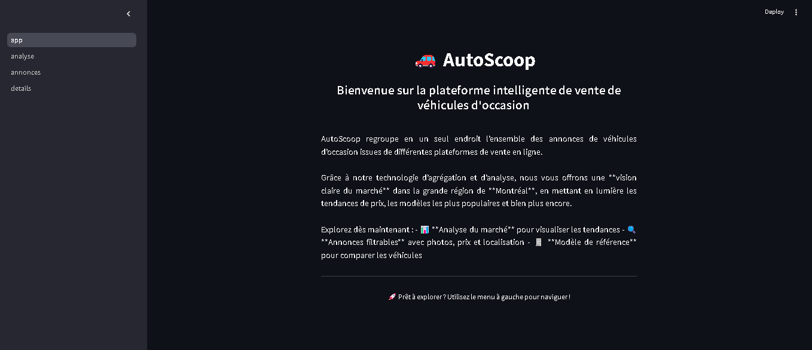
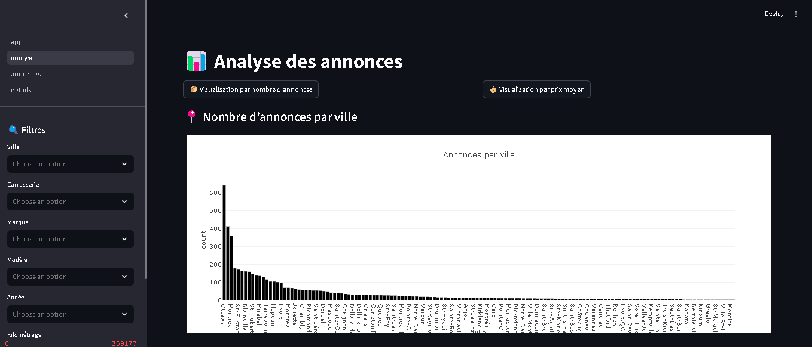

# 📘 AutoScoop

**AutoScoop** est une application Streamlit qui analyse et affiche des annonces de véhicules provenant de plusieurs sources.  
Elle aide les utilisateurs à trouver de bonnes affaires et à visualiser le marché des voitures d'occasion.

## 🚀 Technologies utilisées
- Python
- Streamlit
- PostgreSQL (version **14 ou supérieure**)
- Docker (pour le développement local)
- Apache Airflow (pour l'automatisation ETL)

## 🛠️ Installation

### 1. Prérequis
- Avoir installé **Docker** et **Docker Compose**.
- Avoir installé **PostgreSQL ≥ 14** sur votre machine.
- Avoir **Python 3.10** ou supérieur.

### 2. Cloner le dépôt

```bash
git clone https://gitlab.info.uqam.ca/mboumba.moustapha_adrien/auto-mig8110.git
cd auto-mig8110
```

### 3. Installer les dépendances Python

```bash
pip install -r requirements.txt
```

### 4. Initialiser la base de données

- Démarrer le container Docker pour PostgreSQL :
```bash
docker-compose up -d db
```

- Exécuter le script `init_tables.sh` pour créer la structure des tables :
```bash
bash init/init_tables.sh
```
(Le script va copier et exécuter `init_db.sql` dans la base de données `Projet_auto`.)

---

## 📦 Utilisation

### Lancer l'application Streamlit

```bash
streamlit run app.py
```
L'application se connectera automatiquement à votre base de données locale PostgreSQL et affichera les données.

---

## ⚡ Utilisation rapide avec Makefile

Pour automatiser toute l'installation et le lancement de l'application, vous pouvez utiliser le fichier `Makefile` fourni.

```bash
make setup
```

Cela va automatiquement :
- Installer les dépendances Python
- Démarrer la base de données
- Initialiser les tables
- Lancer l'application Streamlit

Pour arrêter tous les services :

```bash
make clean
```

> **Remarque** : Assurez-vous que `make` est installé sur votre machine (Git Bash ou WSL recommandé sur Windows).

---

## 🖼️ Captures d'écran



---

## 🙌 Remerciements
- L'Université du Québec à Montreal
- Monsieur Salah Aziz notre encadrant & professeur
- L'équipe de développement et collègues Anas-Baki Sanheji, Moustapha Adrien & Youssef Meddeb
- Documentation officielle Streamlit
- Documentation officielle PostgreSQL
- Communauté Plotly

